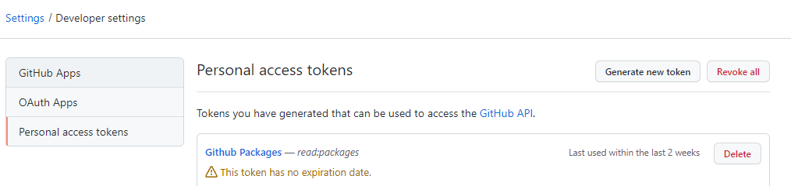
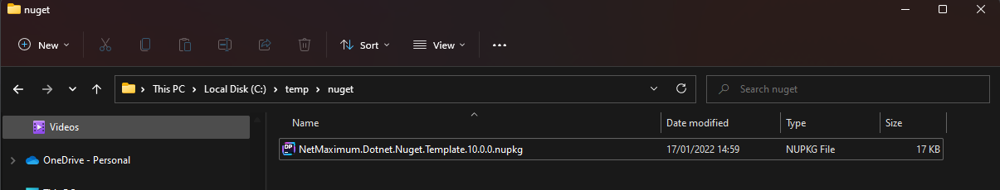
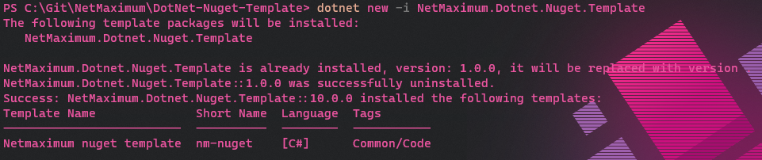

# Net Maximum - Dotnet public nuget template.

## Using the template

```
dotnet new -i NetMaximum.Dotnet.Nuget.Template
```

After installing the latest version you should be able to create a new template, firstly create a new directory for the solution and then run, replacing the repo parameter with the url of the new repository:

* pn = Project Name
* rn = Repo Url

```
dotnet new nm-nuget -pn MYNAME -rn https://github.com/NetMaximum/Kafka/
```

*Note : IT'S IMPORTANT TO GET THE URL FOR THE REPO CORRECT, GITHUB WON'T ACCEPT THE PACKAGE TO THE FEED OTHERWISE.*


### GitHub Nuget Feed

Pre release packages are pushed to a temp holding area within GitHub, this allows a final testing place before being migrated to [nuget](https://www.nuget.org/profiles/NetMaximum).

To use this feed an auth token needs to be generated, this can be done inside the developer settings area of GitHub, the token needs to have read:packages permissions.



Once you have this token replace it in the command below:

```
dotnet nuget add source --username "YOURUSERNAME" --password REPLACEWITHTOKEN --store-password-in-clear-text --name github "https://nuget.pkg.github.com/NetMaximum/index.json"
```

## Local Development

### Local feed

Locally it's easy to create a folder and use it as a nuget feed, in the following example we'll assume this to be a temp folder. Run the following from the root of the repo.

```
dotnet pack Pack.csproj --configuration Release --no-restore --verbosity normal --output nupkgs -p:PackageVersion=10 -o c:\temp\nuget
```

The package version doesn't really matter it just needs to be higher than anything else so you always get your local version of the package and not something from an external feed. To be sure you could disable all your other feeds.




### Install the template

```
dotnet new -i NetMaximum.Dotnet.Nuget.Template
```



### Uninstall the template

```
dotnet new -u NetMaximum.Dotnet.Nuget.Template
```

### Create a test project from the template

* pn = Project Name
* rn = Repo Url

Notice the use of the force parameter to override any previous runs of the test.

```
dotnet new nm-nuget -pn MYNAME -rn https://github.com/NetMaximum/Kafka/ --force
```